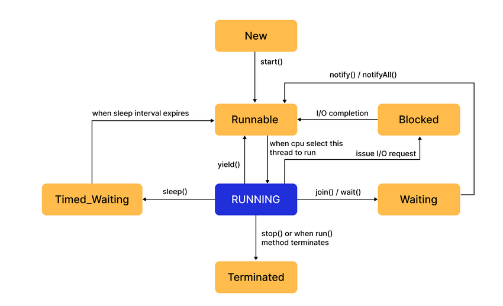

### Thread Lifecycle in Java 🔄

1. #### New State  
     *  `Thread thread = new Thread(() -> System.out.println("Hello from thread"));`  
     *  `// Thread is in NEW state here`
2. #### RUNNABLE 🏃‍♂️
     *  Thread is ready for execution and waiting for CPU allocation 
     * Once start() is called, thread moves to this state 
     * Includes ready-to-run state.  
     * `Thread thread = new Thread(() -> System.out.println("Hello from thread"))`;  
     *  `thread.start(); // Thread moves to RUNNABLE state`
3. #### RUNNING ⚙️
     * The thread is currently executing its task on the CPU.  
     * The CPU scheduler has allocated processing time to this thread.
     * `public void run() {`
     * `System.out.println("Thread is now RUNNING.");`
     * `// ... thread's task execution ...}`
4. #### BLOCKED 🚧
     * Thread is temporarily inactive while waiting to acquire a lock
     * Typically occurs when trying to enter a **synchronized block/method already locked** by another thread 
5. #### WAITING ⏳

     * Thread is waiting indefinitely for another thread to perform a specific action
     * Entered via methods like Object.wait(), Thread.join(), or LockSupport.park()
     * No timeout specified 

   A thread enters the **WAITING state** when it is **indefinitely waiting for another thread to perform a specific action** before it can proceed.

   #### 🛠 Entered via methods like:
   * `Object.wait()`
   * `Thread.join()`
   * `LockSupport.park()`
        
        ❌ No timeout is specified, meaning the thread will **remain stuck indefinitely**  
        **unless another thread wakes** it up using the notify() or notifyAll() method.

6. #### TIMED_WAITING ⏱️

     * Thread is waiting for a specified period of time
     * Entered via methods like Thread.sleep(timeout), Object.wait(timeout), etc.
     * Will automatically return to RUNNABLE after timeout expires or notification

7. #### TERMINATED 🏁

     * Thread has completed its execution or was stopped
     * The run() method has exited, either normally or due to an exception
     * Thread object still exists but cannot be restarted 

