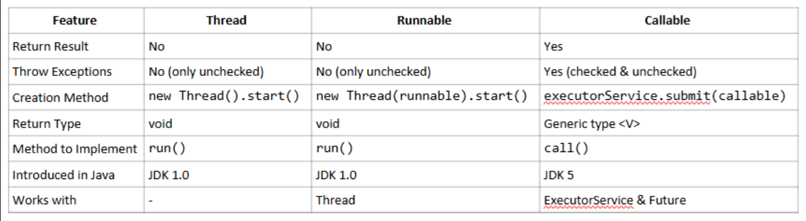

### Java Threads🧵🔄

Threads are fundamental units of execution in Java that allow programs to perform multiple tasks concurrently. They enable developers to create responsive applications, utilize multi-core processors efficiently, and improve overall application performance. 🚀💻 

### Processes vs Threads: Understanding Concurrent Execution 🖥️🔄

Processes and threads are both fundamental concepts in concurrent computing, but they have distinct characteristics and use cases. Let's explore their similarities and differences to provide a comprehensive understanding. 

**Comparison Table: Processes vs Threads :** 

### When to Use Threads: 
*  You need to perform multiple tasks within the same application 
*  Tasks need to share common data quickly 
*  You want to **improve responsiveness and performance** of a single application 

### Real Life Examples :

1. 📱 Mobile Apps: A messaging app like WhatsApp uses threads to handle UI updates and background network requests simultaneously. 
2. 🛒 E-commerce Platforms: Websites like Amazon use threads to allow multiple users to browse, add to cart, and checkout simultaneously while sharing inventory data. 
3. 🎵 Music Streaming Services: Apps like Spotify use threads to keep the UI responsive while continuously buffering audio in the background.

### Key Features of Threads 🔑 

1. ### Concurrent Execution:
      Multiple threads can run simultaneously, allowing programs to perform multiple tasks at once. 🔄,
##### 📌 Example : 
   In a web browser, one thread can handle user interactions (scrolling, clicking), while another thread loads a
   web page in the background. This prevents the UI from freezing while content is still loading. 

2. ### Resource Sharing:
      Threads within the same process share memory and resources, making communication between threads efficient. 🤝

##### 📌 Example (for Resource Sharing):

In a text editor like Microsoft Word, multiple threads handle different tasks—one thread checks spelling and grammar, another auto-saves the document, while another processes user input. Since all threads share the same document data, resource sharing ensures efficiency without redundant memory usage. 

3. ### Lightweight:
     Threads require fewer resources compared to creating multiple processes. 🪶

##### 📌 Example (for Lightweight):

In a multiplayer online game, multiple threads manage player movements, background music, and network communication. Since creating a new process for each task would be costly, using threads keeps the game smooth and responsive while consuming fewer resources.

### Thread vs Runnable: Which to Choose? 🤔 

### Callable vs. Thread vs. Runnable Comparison :

#### Best Practices for Thread Implementation 👨‍💻

1. **Use Runnable over Thread extension** when possible for better **design principles**. 👍
2. **Keep synchronization** minimal to avoid performance bottlenecks. 🔒 
3. **Handle interruptions** properly to ensure graceful thread termination. ⚠️ 
4. **Avoid thread starvation** by balancing priorities and resource allocation. ⚖️ 
5. **Use higher-level concurrency** utilities from java.util.concurrent package for complex scenarios. 📦 
